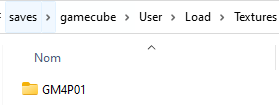

# XBOX 360



Game Console - Lifespan: 2005 - 2016



## Information

| **Emulators**      | <ul><li>xenia-canary</li><li>xenia</li></ul>             |
| ------------------ | -------------------------------------------------------- |
| **File folder**    | :open\_file\_folder: roms \ :open\_file\_folder: xbox360 |
| **File extension** | .iso .xex .xcp .m3u                                      |

## Bios Information

No specific BIOS requirements to play Xbox 360 games on xenia / xenia-canary emulators.

## Controls

Retrobat does not offer automatic controller configuration for xenia / xenia-canary.

However, when using a XBOX controller, controls will work out of the box.

## Specific system information

### Adding XBLA (Xbox Live Arcade) games

Xbox360 **XBLA** games (**XB**ox **L**ive **A**rcade) are presented in the form of a succession of several folders, which end in a file that has no extension.

For example for _Banjo Tooie_ game, the filepath is the following:

**\Banjo Tooie\58410955\000D0000\ABB9CAB336175357D09F2D922735D23C62F90DDD**

For Retrobat to be able to launch the game, you must create a **\*.m3u** file to be placed at the root of the `\roms\xbox360` folder.

<figure><figcaption><p>Example for Banjo Tooie</p></figcaption></figure>

The content of the .m3u file is the following:

```
\Banjo Tooie\58410955\000D0000\ABB9CAB336175357D09F2D922735D23C62F90DDD
```


BATGUI tool offers an automatic m3u creation tool. Refer to the [BATGUI ](../../advanced-features/batgui.md)section of the wiki.

